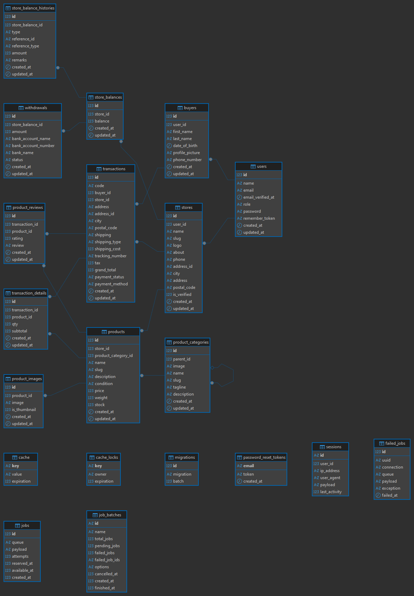

# E-Commerce Laravel Project - Kelompok 1

Aplikasi E-Commerce berbasis Laravel dengan fitur lengkap untuk Customer, Seller, dan Admin.

## Daftar Isi
- [Fitur Utama](#fitur-utama)
- [Teknologi](#teknologi)
- [Instalasi](#instalasi)
- [Struktur Database](#struktur-database)
- [Akun Login](#akun-login)
- [Cara Menjalankan](#cara-menjalankan)

---

## Fitur Utama

### Customer (Pembeli)
- Browse produk dan kategori
- Pencarian dan filter produk
- Keranjang belanja
- Wishlist
- Checkout dan pembayaran
- Riwayat transaksi
- Review produk

### Seller (Penjual)
- Registrasi dan manajemen toko
- CRUD Produk (dengan upload gambar)
- Manajemen pesanan
- Saldo toko dan riwayat
- Penarikan saldo (withdrawal)

### Admin
- Verifikasi toko
- Manajemen user dan toko
- Approval penarikan saldo

---

## Teknologi

- **Framework:** Laravel 11
- **Authentication:** Laravel Breeze
- **Database:** MySQL
- **Frontend:** Blade Templates + Vite
- **Styling:** CSS (Custom)

---

## Instalasi

### Prasyarat
Pastikan Anda sudah menginstall:
- PHP >= 8.2
- Composer
- Node.js & NPM
- MySQL / MariaDB

### Langkah Instalasi

1. **Clone Repository**
   ```bash
   git clone https://github.com/Rizal-Room/e-commerce-kelompok-1.git
   cd e-commerce-kelompok-1
   ```

2. **Install Dependencies**
   ```bash
   composer install
   npm install
   ```

3. **Setup Environment**
   ```bash
   cp .env.example .env
   php artisan key:generate
   ```

4. **Konfigurasi Database**
   
   Buat database baru di MySQL, lalu edit file `.env`:
   ```env
   DB_CONNECTION=mysql
   DB_HOST=127.0.0.1
   DB_PORT=3306
   DB_DATABASE=e_commerce_kelompok_1
   DB_USERNAME=root
   DB_PASSWORD=
   ```

5. **Migrasi Database & Seeder**
   ```bash
   php artisan migrate --seed
   ```
   
   Seeder akan otomatis membuat:
   - Akun Admin
   - Kategori produk
   - Produk dummy

6. **Storage Link (untuk upload gambar)**
   ```bash
   php artisan storage:link
   ```

---

## Struktur Database



## Akun Login

Setelah menjalankan `php artisan migrate --seed`, akan tersedia akun berikut:

### Admin
- **Email:** admin@example.com
- **Password:** password
- **Role:** Admin
- **Akses:** Verifikasi toko, approval withdrawal, user management

### Seller (Perlu registrasi manual)
Untuk menjadi seller:
1. Register akun baru di `/register`
2. Login dengan akun yang baru dibuat
3. Buat toko di `/seller/register`
4. Tunggu approval dari admin
5. Setelah di-approve, akses dashboard seller di `/seller/dashboard`

atau bisa juga:
- **Email:** seller@example.com
- **Password:** password
- **Role:** Seller
- **Akses:** Dashboard seller, toko management, produk management, penarikan saldo

### Customer (Semua user bisa belanja)
Setiap user yang register otomatis bisa belanja. Tidak perlu role khusus.
- **Email:** buyer@example.com
- **Password:** password
- **Role:** Customer
- **Akses:** Dashboard buyer, keranjang, checkout, riwayat transaksi

---

## Cara Menjalankan

1. **Jalankan Development Server**
   ```bash
   php artisan serve
   ```
   Aplikasi bisa diakses di: `http://localhost:8000`

2. **Compile Assets (Terminal Baru)**
   ```bash
   npm run dev
   ```

3. **Login sebagai Admin**
   - Buka `http://localhost:8000/login`
   - Gunakan kredensial admin di atas
   - Akses admin panel di `http://localhost:8000/admin/dashboard`

---

## Catatan Penting

### Upload Gambar
- Gambar produk dan logo toko disimpan di `storage/app/public`
- Pastikan sudah run `php artisan storage:link`
- Format yang diterima: JPEG, PNG, JPG (max 2MB)

### Workflow Toko Baru
1. User register → Login
2. Seller buat toko → Status: `Pending`
3. Admin approve → Status: `Verified`
4. Seller bisa mulai upload produk

### Sistem Pembayaran
- **COD & Bank Transfer:** Status `unpaid` (butuh konfirmasi manual)
- **E-Wallet & Credit Card:** Status `paid` (otomatis)

### Sistem Saldo
- Saldo toko bertambah saat transaksi berstatus `Completed`
- Seller mengajukan withdrawal
- Admin approve/reject
- Jika reject, saldo dikembalikan ke toko

---

## Tim Pengembang

**Kelompok 1** - 3 Anggota:
- Akhtar Fateh: Fitur Admin & Autentikasi
- Iwang Evelyna: Fitur Seller
- Muchammad Rizal: Fitur Customer

---

## Lisensi

Project ini dibuat untuk keperluan tugas UAP Pemrograman Web.

---

**Salam PHP Lovers!**
